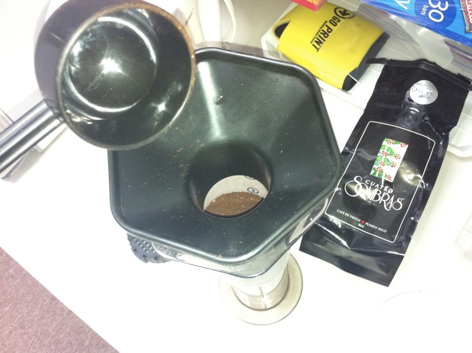
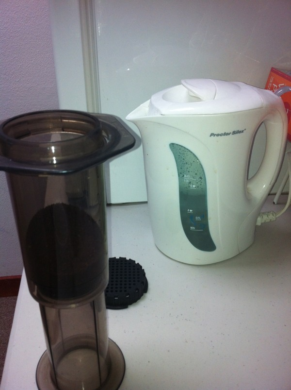
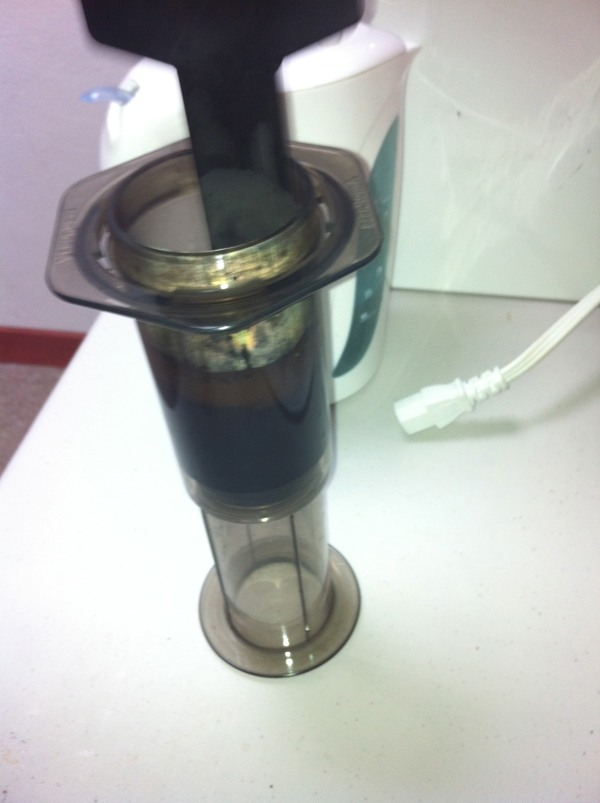
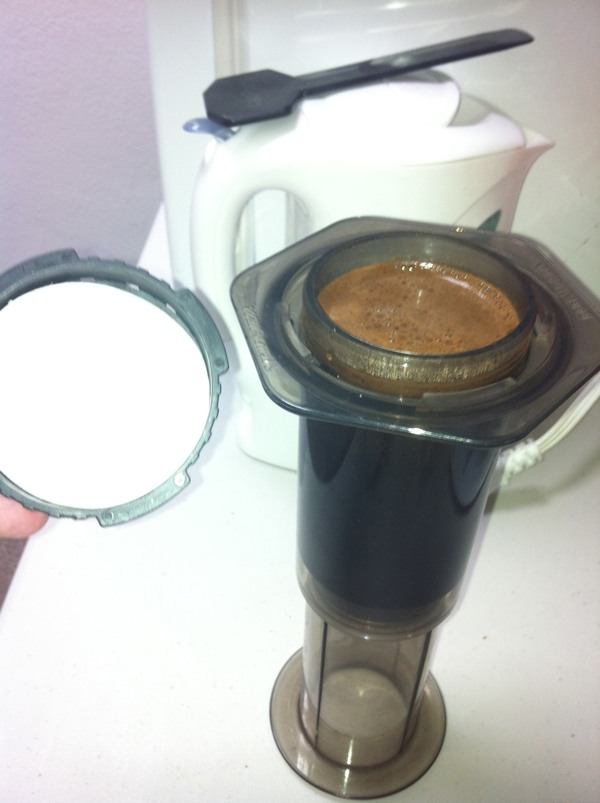
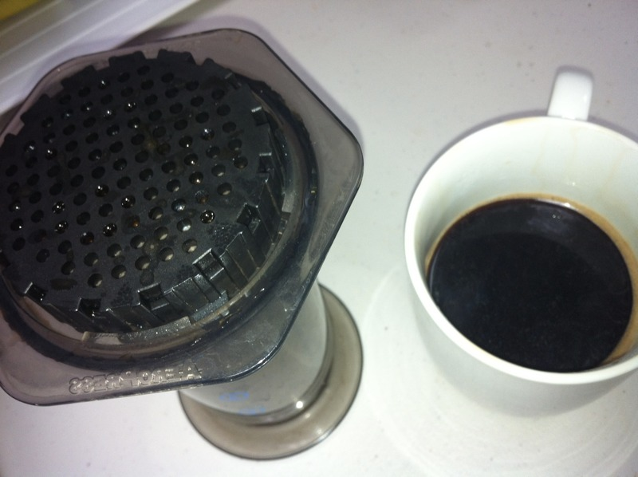

Want to brew a great cup of coffee without making too much of a mess? Buy this. It’s called an Aeropress. Now buy some quality coffee beans. You got a grinder, right? I won’t judge you if you won’t. Just ask your barista to grind your beans one step above espresso grind. You want a fine grind, but not too fine to clog the paper filter.

We will be using the inverted Aeropress method. Why? I don’t know. Some people prefer this over the normal method, since it keeps the paper filter away from the coffee until its needed. Some people like to run some water over the paper filter beforehand (they say doing this will keep your coffee from having a paper-filtery-taste, which I’ve never noticed anyway), and doing this with the regular method will result in coffee leaking out prematurely. I prefer it because its less messy and its all self-contained. Lets begin.

There’s two main parts to an Aeropress: the cylinder that holds the grounds and water, and the plunger. Normally you’d mix everything in the main cylinder, and then use the plunger. Instead, grab the plunger and push it in just one centimeter or so. Place the Aeropress upside down, with the plunger holding up the main cylinder. Leave the filter off for now.

Measure two scoops of ground coffee into your inverted Aeropress. Boil some water while you’re at it. Since I’m brewing this at the office, I’m using an electric kettle. At home, I have a metal stovetop kettle.

Done boiling that water? Set it aside. Give it 30 seconds or so. You want to brew the coffee at 175 degrees Fahrenheit. It all depends on your setup, but I’ve found that the water in the electric kettle takes around 30 seconds to drop to 180 F, and considering it might drop a few more degrees once its poured, thats when I like to commence brewing. Using my stovetop kettle, it takes more like a minute, enough to finish serving breakfast.

Pour water into the Aeropress until it’s half-full. Now stir it up for 10 seconds, no more, no less. Top it off with more hot water and wait 30 seconds. Get the paper filter ready.

Screw the filter in, invert the Aeropress unto your mug, and push down on the plunger. Don’t force it. Take it easy. Relax. Smell the coffee. Ahhhh.

That’s it! Coffee’s ready. You may now drink it, or proceed to ruin it with your dairy and sugar of choice.

Cleanup is easy: throw away the puck, and rinse the plunger. No need to wash anything else, it’s pretty much self-cleaning.

Some people say these are too many steps. Well, it looks like that when you first read about the process. Once you’ve done it once or twice, it’s real easy to just go through the steps without thinking about it. Here’s a recap:

Boil water.
Add two scoops of ground coffee to inverted Aeropress.
Pour hot water up to half point. Stir for 10 seconds.
Wait 30 seconds.
Screw in filter and push down on plunger.
Drink!
Filed Under: Coffee

Héctor Ramos
Footer
Tesla Referral Code
Copyright © 2025 · Maker Pro on Genesis Framework · WordPress · Log in
