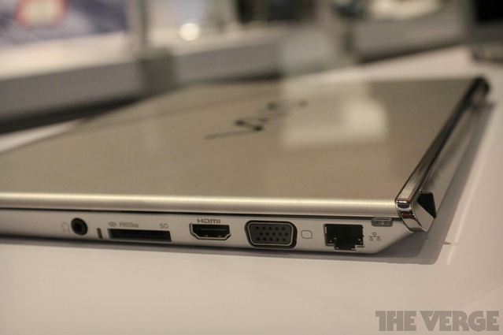
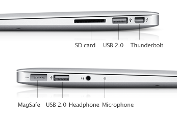

There’s something about non-Apple laptops that bugs me. It’s a very small detail, admittedly, but when you’re paying hundreds of dollars for a piece of equipment that is essential to my line of work, every little detail counts.

The ports.

Sony just announced their latest [“Ultrabook” prototype laptop](http://www.theverge.com/2012/1/10/2696098/sony-shows-off-vaio-ultrabook-prototype-behind-glass/in/2454903), and while it is behind glass, the lackluster build quality is obvious. Look at those ugly, nasty ports. Why is there a VGA port in an ultrabook? That VGA port, along with the Ethernet port, add too much heft to the laptop. They probably could have made the laptop half as thick just by getting rid of those two ports. In order to do that, you need to also use half as much internal volume for your motherboard, memory and storage, which judging by the outward appearance, I don’t think Sony tried slimming those down anyway.

It’s not just about the thickness, though. Look at the audio out, the smallest of all the ports. What’s wrong with it? That black rubber all around it. Is it necessary? Now you have one rubber port, leaving a gap between it and the chassis. Same with the HDMI port. There’s a metal border around the port, in addition to the actual laptop chassis. Note that the VGA port is the worst offender when it comes to this. It just looks shitty, there’s no other way about it.

How does Apple do it? All the ports are built into the chassis. It’s all streamlined, no gaps, no rubber parts poking out of the laptop. And no ugly, outdated, VGA port.

These are the ports on the 2011 13″ MacBook Air. If you need HDMI, you plug in a Mini-DisplayPort to HDMI cable into the Thunderbolt port. Need VGA? There’s a Mini-DisplayPort to VGA cable as well. The small Thunderbolt port has replaced a huge, ugly VGA port with no sacrifice made when it comes to function and design. The audio port is flush with the chassis. It just looks good.

This is not new to the MacBook Air, however. All unibody Apple laptops have the same basic port design. It’s been this way since 2008. Hasn’t Sony noticed this?

And that’s just one of the reasons I’ll never buy a Sony laptop again. (Another being that my Sony VAIO got a busted audio out port within three months of purchasing it.)
