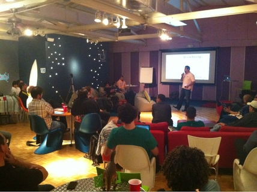
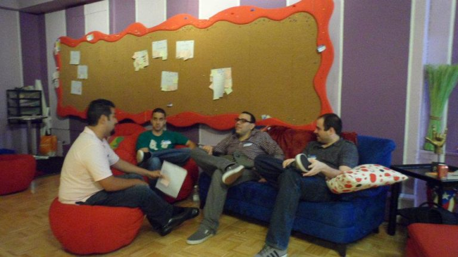

This past weekend, Puerto Rico had its first official [Startup Weekend](http://puertorico.startupweekend.org/) event. The premise was simple: launch a startup in 54 hours.

Over 50 passionate designers, developers, business development and creatives met on Friday night and pitched dozens of ideas. They assembled into seven teams with the goal of developing a business model and prototype by Sunday evening to pitch to angel investors and venture capitalists.

The event was hosted by the team from Seriously Creative, with organizers Giovanni Collazo, Jos� Padilla, Ramphis Castro, and Marcos Polanco. A team of advisers and mentors was available to help teams with product development, marketing, design, legal assistance, and business model development.

The seven startup ideas presented were:

1. **Help Now!** - A mobile app with a panic button for emergency alerts
2. **FAQ.ly** - A hosted Q&A solution with SEO optimization
3. **GameBoost.me** - A mobile game app framework with virtual ticket rewards
4. **Emagine.it** - Virtual adventure experiences for kids
5. **Table Order** - A mobile ordering system for restaurant staff
6. **Tipbell** - An employee feedback platform for the tourism industry
7. **Social Time Clock** - A geolocated social network for friend groups

After presentations and judging, **Tipbell** was declared the winner, receiving:

- $24,000 in Rackspace hosting
- $40,000 in legal consulting
- $10,000 in marketing consulting
- Additional credits and startup resources

This was an incredible event that showcased Puerto Rico's growing startup ecosystem. The energy and passion displayed by all participants was truly inspiring, and I'm excited to see what comes next for these teams and the local entrepreneurial community.
